## 1.1 Latar Belakang

TimeVibes muncul sebagai respons terhadap perubahan signifikan dalam cara kita mengelola waktu dan menghadapi kehidupan sehari-hari di era digital. Faktor-faktor berikut membentuk latar belakang yang lebih kompleks untuk aplikasi ini:

1. **Gaya Hidup Multitasking:** Gaya hidup modern menuntut kita untuk melakukan banyak hal sekaligus. Kita bisa menjadi pekerja, orang tua, pelajar, dan sekaligus mencoba menjaga kesehatan dan hobi. Kehidupan sehari-hari menjadi semakin kompleks, dan kita sering merasa terjebak dalam keterlibatan berbagai aktivitas.

2. **Gangguan Digital:** Teknologi, terutama ponsel pintar dan media sosial, telah membawa gangguan yang tidak terhindarkan. Notifikasi, pesan teks, dan konten digital bersaing untuk perhatian kita setiap saat. Ini mengganggu konsentrasi dan fokus kita.

3. **Meningkatnya Kesejahteraan Mental:** Kesadaran akan pentingnya kesejahteraan mental semakin berkembang. Banyak individu mencari cara untuk mengelola stres, kecemasan, dan tekanan, serta menciptakan ruang untuk diri mereka sendiri.

4. **Tantangan Produktivitas:** Efisiensi dan produktivitas adalah hal-hal yang sangat dihargai. Namun, tidak semua orang tahu bagaimana mengatur waktu mereka dengan baik, sehingga banyak waktu berharga terbuang sia-sia.

5. **Mendekati Tujuan Pribadi:** Semakin banyak orang yang memiliki tujuan dan impian pribadi yang ingin mereka raih. Namun, mencapai tujuan ini sering kali memerlukan perencanaan yang baik dan konsistensi dalam tindakan sehari-hari.

6. **Ketidakseimbangan Kehidupan:** Banyak individu mencari keseimbangan antara pekerjaan, kehidupan pribadi, dan waktu luang. Mereka ingin menjalani hidup yang lebih bermakna dan memuaskan.

7. **Potensi Teknologi:** Teknologi, seperti kecerdasan buatan dan analitik data, memiliki potensi besar untuk membantu kita mengelola waktu dan merencanakan aktivitas secara lebih cerdas.

TimeVibes berusaha mengatasi latar belakang ini dengan memberikan pengguna alat yang kuat dan personal untuk merencanakan waktu mereka, mengelola gangguan digital, mencapai tujuan pribadi, dan menjalani hidup yang lebih seimbang dan bermakna. Aplikasi ini berusaha menciptakan pengalaman yang menghormati kebutuhan unik setiap pengguna sambil memanfaatkan teknologi terbaru untuk memberikan solusi yang canggih dan efektif.

**Penelitian tentang Mood dan Produktivitas: uji validitas Four Dimensions Mood Scale**

**Demografi Partisipan:**

| Demografi Partisipan | Data (%)                                  |
| -------------------- | ----------------------------------------- |
| Rentang Usia         | 15 - 69 tahun                             |
| Modus Usia           | 18 tahun                                  |
| Jenis Kelamin        |                                           |
| - Laki-laki          | 29.9%                                     |
| - Perempuan          | 64.6%                                     |
| - Missing            | 4.8%                                      |
| Pekerjaan            |                                           |
| - Belum Bekerja      | 16%                                       |
| - Ibu Rumah Tangga   | 0.2%                                      |
| - Pegawai Negeri     | 0.2%                                      |
| - Pegawai Swasta     | 1.4%                                      |
| - Pelajar            | 56.5%                                     |
| - Pelatih/Pengajar   | 0.2%                                      |
| - Kandidat Doktor    | 0.2%                                      |
| - Tidak Bekerja      | 3.8%                                      |
| - Wiraswasta         | 0.2%                                      |
| - Null               | 20.3%                                     |
| Kota (Tinggal)       |                                           |
| - Bekasi             | 6.2%                                      |
| - Bogor              | 4.8%                                      |
| - Jakarta            | 9.6%                                      |
| - Bandung            | 7.7%                                      |
| - Makassar           | 2.2%                                      |
| - Yogyakarta         | 2.4%                                      |
| - Null               | 20.1%                                     |
| Agama                |                                           |
| - Budha              | 0.2%                                      |
| - Hindu              | 1.4%                                      |
| - Islam              | 68.9%                                     |
| - Katolik            | 1.7%                                      |
| - Kristen            | 6.9%                                      |
| - Tidak Ada Data     | 20.1%                                     |
| Dispersi Agama       | Di bawah 1% tersebar di seluruh Indonesia |

**Hasil pengujian**

| Item                     | Model I | Model II | Model III |
| ------------------------ | ------- | -------- | --------- |
| Positive Energy          | 0.59    | 0.60     | 0.61      |
| Aktif                    | 0.29    | -        | -         |
| Waspada                  | 0.60    | 0.60     | 0.60      |
| Bergairah (non-seksual)  | 0.52    | 0.52     | 0.52      |
| Penuh atensi (perhatian) | 0.55    | 0.55     | 0.56      |
| Bertekad                 | 0.60    | -        | 0.59      |
| Berhasrat (non-seksual)  | 0.65    | 0.66     | 0.67      |
| Enerjik                  | 0.46    | 0.46     | 0.47      |
| Antusias                 | 0.41    | 0.40     | 0.40      |
| Bersemangat              | 0.37    | -        | -         |
| Terinspirasi             | 0.40    | 0.39     | -         |
| Tertarik                 | 0.54    | 0.53     | 0.50      |
| Menggebu-gebu            | 0.62    | 0.61     | 0.58      |
| Bangga                   | xx      | xx       | xx        |
| Kuat                     | xx      | xx       | xx        |
| Bergelora                | xx      | xx       | xx        |
| Tiredness                | 0.46    | 0.46     | 0.46      |
| Bosan                    | 0.77    | 0.77     | 0.77      |
| Lesu                     | 0.43    | 0.43     | 0.43      |
| Mati rasa                | 0.56    | 0.53     | 0.56      |
| Mengantuk                | 0.53    | 0.53     | 0.53      |
| Lamban                   | 0.81    | 0.81     | 0.81      |
| Lelah                    | 0.73    | 0.73     | 0.73      |
| Capai                    | 0.70    | 0.70     | 0.70      |
| Penat                    | 0.55    | 0.55     | 0.55      |
| Jerih                    | xx      | xx       | xx        |
| Negative Arousal         | 0.60    | 0.60     | 0.60      |
| Takut                    | 0.58    | 0.58     | 0.58      |
| Marah                    | 0.62    | 0.62     | 0.62      |
| Jengkel                  | 0.57    | 0.57     | 0.57      |
| Cemas                    | 0.54    | 0.54     | 0.54      |
| Malu                     | 0.55    | 0.55     | 0.55      |
| Di bawah tekanan         | 0.57    | 0.57     | 0.57      |
| Bersalah                 | 0.50    | 0.50     | 0.50      |
| Bermusuha                | 0.65    | 0.65     | 0.65      |
| Mudah marah              | 0.60    | 0.60     | 0.60      |
| Gelisah                  | 0.68    | 0.68     | 0.68      |
| Gugup                    | 0.54    | 0.54     | 0.54      |
| Ngeri                    | xx      | xx       | xx        |
| Tegang                   | xx      | xx       | xx        |
| Kesal                    | xx      | xx       | xx        |
| Relaxation               | 0.42    | 0.42     | 0.42      |
| Santai                   | 0.36    | -        | -         |
| Kalem                    | xx      | xx       | xx        |
| Puas                     | 0.41    | 0.40     | 0.40      |
| Tak acuh                 | 0.10    | -        | -         |
| Damai                    | 0.51    | 0.51     | 0.51      |
| Tenang                   | 0.70    | 0.70     | 0.70      |
| Terpuaskan               | 0.59    | 0.59     | 0.59      |
| Hening                   | 0.50    | 0.49     | 0.49      |
| Rileks                   | 0.76    | 0.76     | 0.76      |
| Adem ayem                | 0.74    | 0.74     | 0.74      |
| Tentram                  | 0.80    | 0.80     | 0.80      |
| Khidmat                  | 0.83    | 0.83     | 0.83      |
| Khusyuk                  | 0.74    | 0.74     | 0.74      |
| Jernih                   | 0.70    | 0.70     | 0.70      |
| Tidak terganggu          | 0.49    | 0.49     | 0.49      |

Angka-angka yang diberikan adalah nilai Standardized Factor Loadings (SFL) untuk masing-masing item FDMS dalam tiga model yang diuji (Model I, Model II, dan Model III) dalam konteks Indonesia. SFL mengukur kekuatan hubungan antara setiap item dan faktor yang diukur dalam model. Berikut adalah makna angka-angka tersebut:

- **Positive Energy**: Angka-angka ini mengukur kontribusi item-item terhadap faktor emosi positif yang terkait dengan energi, semangat, dan perasaan positif. Semakin tinggi nilai SFL, semakin kuat hubungannya dengan faktor positif ini.

- **Tiredness**: Nilai-nilai ini mengukur kontribusi item-item terhadap faktor kelelahan dan perasaan lelah. Semakin tinggi nilai SFL, semakin kuat hubungannya dengan faktor kelelahan ini.

- **Negative Arousal**: Angka-angka ini mengukur kontribusi item-item terhadap faktor arousal negatif, yang mencakup emosi-emosi seperti ketakutan, kemarahan, kecemasan, dan stres. Semakin tinggi nilai SFL, semakin kuat hubungannya dengan faktor arousal negatif ini.

- **Relaxation**: Nilai-nilai ini mengukur kontribusi item-item terhadap faktor relaksasi dan perasaan positif yang terkait dengan ketenangan dan ketenangan. Semakin tinggi nilai SFL, semakin kuat hubungannya dengan faktor relaksasi ini.

Dari data yang diberikan, terdapat tiga model yang diuji (Model I, Model II, dan Model III) dengan jumlah item yang berbeda-beda. Model ini mencoba untuk mengevaluasi sejauh mana FDMS sesuai dalam konteks Indonesia.

- Nilai SFL yang mendekati 1 (1,00) dianggap sangat tinggi, menunjukkan bahwa item memiliki kontribusi yang sangat kuat terhadap faktor yang diukur.
- Nilai SFL yang mendekati 0 (0,00) atau sangat dekat dengan 0 dianggap rendah, menunjukkan bahwa item memiliki kontribusi yang lemah atau tidak signifikan terhadap faktor yang diukur.

## 1.2. Deksripsi Teknologi Informasi

TimeVibes adalah aplikasi revolusioner yang menyederhanakan pengelolaan waktu, meningkatkan produktivitas, dan meningkatkan kesejahteraan pribadi pengguna. Aplikasi ini bertujuan membantu pengguna "Menemukan Ritme Pribadi" mereka dan "Maksimalkan Waktu" yang dimiliki. Dengan pendekatan yang inovatif terhadap manajemen waktu, analitik mood, dan rekomendasi aktivitas yang dipersonalisasi, TimeVibes membawa pengalaman unik yang membantu Anda merasa lebih terhubung dengan waktu dan lebih produktif.

Berikut adalah beberapa fitur utama TimeVibes:

1. **Manajemen Aktivitas Berbasis Mood**: Aplikasi ini memungkinkan Anda untuk menyesuaikan aktivitas Anda dengan mood Anda saat ini. Dengan analisis mendalam terhadap mood dan perasaan Anda, TimeVibes memberikan rekomendasi aktivitas yang paling cocok untuk saat itu. Ini membantu Anda merasa lebih fokus dan produktif.

2. **Notifikasi Personalisasi**: TimeVibes mengirimkan notifikasi yang dipersonalisasi untuk mengingatkan Anda tentang aktivitas yang telah Anda rencanakan. Notifikasi ini dirancang untuk sesuai dengan mood dan preferensi waktu Anda, sehingga Anda dapat menjalani hari Anda lebih efisien.

3. **Rekomendasi Perencanaan Harian**: Aplikasi ini membantu Anda merencanakan hari Anda dengan rekomendasi perencanaan harian berdasarkan mood dan waktu. Ini membantu Anda mengoptimalkan waktu Anda dan menjadikannya lebih produktif.

4. **Analisis Mood**: TimeVibes mencatat dan menganalisis mood Anda sepanjang waktu. Dengan pemahaman yang lebih dalam tentang perasaan Anda, Anda dapat mengidentifikasi pola dan tren dalam mood Anda dan melakukan penyesuaian yang diperlukan dalam rutinitas harian Anda.

5. **Manajemen Profil Pengguna**: Anda dapat membuat profil pribadi Anda dan mengelola informasi pribadi Anda dalam aplikasi ini. Ini memungkinkan TimeVibes memberikan rekomendasi yang lebih akurat berdasarkan karakteristik Anda.

6. **Interaksi Sosial dan Rekomendasi**: TimeVibes memungkinkan pengguna berinteraksi, memberikan ulasan, dan merekomendasikan aktivitas kepada pengguna lain. Ini menciptakan komunitas produktif di sekitar aplikasi.

7. **Manajemen Admin**: Untuk pemilik bisnis, aplikasi ini menawarkan alat administrasi yang memungkinkan mereka untuk mengelola pengguna dan aktivitas.

8. **Konfigurasi Notifikasi**: Pengguna dapat mengatur preferensi notifikasi dan waktu pengiriman notifikasi sesuai dengan kebutuhan mereka.

TimeVibes memanfaatkan teknologi terbaru untuk menghadirkan pengalaman yang memungkinkan pengguna mengelola waktu dan perasaan mereka secara lebih efisien. Dengan berfokus pada hubungan yang lebih baik dengan waktu dan pencapaian produktivitas yang lebih tinggi, TimeVibes membantu pengguna mencapai keseimbangan hidup yang mereka idamkan.

**berikut algoritma dalam aplikasi TimeVibes:**

**Pengguna (User)**

1. Pengguna membuka aplikasi TimeVibes.
2. Jika belum masuk, pengguna diminta untuk memasukkan kredensial atau mendaftar jika belum memiliki akun.
3. Sistem akan mengotentikasi pengguna menggunakan layanan otentikasi eksternal (OAuth, OpenID Connect, dll.).
4. Jika otentikasi berhasil, pengguna akan memiliki sesi yang valid.
5. Pengguna dapat mengakses halaman profil mereka, melihat mood saat ini, dan mengedit preferensi notifikasi.
6. Profil pengguna mencakup nama, foto profil, gender, tanggal lahir, dan preferensi notifikasi.
7. Pengguna dapat melihat daftar aktivitas yang mereka tambahkan sebelumnya.
8. Pengguna dapat menambahkan, mengedit, atau menghapus aktivitas dari jadwal harian mereka.
9. Sistem akan memberikan rekomendasi aktivitas berdasarkan mood pengguna.
10. Pengguna dapat melihat riwayat aktivitas dan mood mereka.
11. Pengguna dapat melihat analisis mood jangka panjang dan statistik yang membantu mereka memahami perubahan mood mereka.

**Aktivitas (Activity)**

1. Pengguna dapat menambahkan aktivitas yang ingin mereka lakukan, termasuk nama, deskripsi, dan waktu pelaksanaan.
2. Data aktivitas disimpan dalam basis data aktivitas.
3. Sistem akan menghubungkan aktivitas dengan mood pengguna yang sesuai.
4. Sistem akan memberikan notifikasi personal kepada pengguna sebagai pengingat aktivitas yang telah direncanakan.
5. Admin dapat mengelola aktivitas, termasuk mengedit atau menghapus aktivitas yang tersedia di aplikasi.

**Mood Pengguna (Mood)**

1. Pengguna memiliki opsi untuk memilih atau mengganti mood mereka melalui antarmuka aplikasi.
2. Mood yang dipilih oleh pengguna disimpan dalam basis data mood.
3. Sistem akan menggunakannya untuk memberikan rekomendasi aktivitas yang sesuai.
4. Data mood juga digunakan untuk analisis mood jangka panjang.

**Notifikasi (Notification)**

1. Pengguna dapat mengatur preferensi notifikasi mereka, termasuk metode notifikasi (notifikasi push, email) dan waktu pengiriman.
2. Preferensi notifikasi pengguna disimpan dalam basis data notifikasi.
3. Aktivitas yang direncanakan oleh pengguna akan menghasilkan notifikasi yang dikirimkan sesuai dengan preferensi mereka.

**Manajemen Admin (Admin)**

1. Admin memiliki akses ke alat administrasi yang memungkinkan mereka mengelola pengguna, aktivitas, dan konten di aplikasi.
2. Admin dapat mengonfigurasi pesan notifikasi yang dikirimkan kepada pengguna.
3. Admin juga dapat melakukan tugas pemeliharaan dan pembaruan perangkat lunak pada aplikasi.

**Skenario Notifikasi Perubahan Mood:**

1. **Pengguna Masuk ke Aplikasi:**

   - Pengguna telah mendaftar dan masuk ke aplikasi "TimeVibe's."

2. **Tambahkan Aktivitas dan Mood:**

   - Pengguna mulai menambahkan aktivitas mereka ke aplikasi sepanjang hari.
   - Setiap kali mereka menambahkan aktivitas, mereka juga memilih mood yang mereka rasakan saat melakukan aktivitas tersebut.

3. **Perubahan Mood yang Signifikan:**

   - Selama beberapa hari, aplikasi "TimeVibe's" mencatat mood pengguna seiring waktu.
   - Algoritma analisis mood mendeteksi perubahan mood yang signifikan. Misalnya, pengguna biasanya merasa bahagia saat bekerja, tetapi dalam beberapa hari terakhir mereka mulai merasa sedih atau stres saat bekerja.

4. **Notifikasi Personalisasi:**

   - Aplikasi "TimeVibe's" mengirimkan notifikasi kepada pengguna ketika mendeteksi perubahan mood yang signifikan.
   - Notifikasi tersebut dapat berbunyi seperti, "Kami melihat perubahan mood Anda saat bekerja. Apakah ada sesuatu yang sedang mengganggu? Kami dapat membantu Anda mengelola waktu dengan lebih baik."

5. **Tawaran Dukungan:**
   - Notifikasi juga dapat menawarkan dukungan, seperti mengarahkan pengguna ke artikel atau alat bantu untuk mengatasi stres atau merasa lebih baik.
   - Pengguna dapat memilih untuk menerima saran atau hanya mengonfirmasi bahwa mereka menyadari perubahan mood mereka.

## 1.3. Branding

Analysis : Branding

1. Merk : TimeVibe's

2. Tagline: "Discover Your Rhythm, Maximize Your Time."

3. Campaign:

   - _Discover Your Rhythm Campaign_ - Membantu pengguna menemukan ritme produktivitas mereka berdasarkan mood.
   - _Maximize Your Time Campaign_ - Meningkatkan efisiensi waktu pengguna dengan rekomendasi perencanaan harian yang sesuai.

4. Target User:

   - Profesional sibuk yang ingin mengelola waktu dengan lebih efisien.
   - Mahasiswa yang ingin meningkatkan produktivitas belajar.
   - Orang-orang yang peduli dengan manajemen waktu dan kesejahteraan emosional mereka.

5. Tema User Experience:

   - _Personalized Productivity_: Memberikan pengalaman yang dipersonalisasi dengan analisis mood dan rekomendasi aktivitas.
     (Warna: Birch dan Lavender): Memberikan pengalaman yang dipersonalisasi dengan kombinasi warna lembut Birch dan Lavender, mencerminkan kelembutan dan keramahan.

   - _Seamless Workflow_: Memungkinkan pengguna membuat, mengelola, dan mengevaluasi aktivitas dengan mudah.
     (Warna: Ocean dan Sky Blue): Memastikan antarmuka pengguna yang mudah digunakan dengan warna Ocean dan Sky Blue, menghadirkan rasa kesejukan dan kejernihan.

   - _Rhythmic Insights_: Memberikan wawasan tentang pola waktu produktif berdasarkan mood pengguna.
     (Warna: Sunflower dan Mint): Memberikan wawasan tentang pola waktu produktif dengan warna Sunflower dan Mint, menciptakan kesan ceria dan segar.

   - _Empowering Choices_: Memberikan saran berdasarkan analisis mood untuk membuat keputusan yang lebih baik.
     (Warna: Forest dan Moss Green): Memberikan saran berdasarkan analisis mood dengan warna Forest dan Moss Green, memberi kesan kebijakan dan ketenangan.

   - _Connected Community_: Memungkinkan pengguna berbagi ulasan dan rekomendasi aktivitas dengan komunitas.
     (Warna: Coral dan Sandstone): Memfasilitasi keterlibatan komunitas dengan warna Coral dan Sandstone, menciptakan suasana persahabatan dan kebersamaan.

Kampanye "Discover Your Rhythm" akan fokus pada memperkenalkan fitur-fitur analisis mood dan pengaturan aktivitas yang dapat disesuaikan. Kampanye "Maximize Your Time" akan menyoroti manfaat penggunaan rekomendasi perencanaan harian untuk mencapai produktivitas yang lebih tinggi.

Struktur data dan arsitektur sistem yang telah dibuat akan mendukung tema pengalaman pengguna ini dengan menyediakan data yang diperlukan untuk menganalisis mood, menyimpan aktivitas, dan memberikan rekomendasi yang relevan. Selain itu, fitur-fitur notifikasi yang dipersonalisasi akan memastikan pengguna selalu memiliki visibilitas tinggi tentang jadwal dan tugas mereka.

Penggunaan warna-warna ini dalam tema pengalaman pengguna akan membantu menciptakan perasaan yang sesuai dengan setiap fitur dan membuat TimeVibes menjadi aplikasi yang menarik secara visual dan berfungsi dengan baik.

Dengan kombinasi yang baik antara data, teknologi, dan pengalaman pengguna, TimeVibe's akan menjadi alat andal dalam manajemen waktu dan perencanaan yang responsif terhadap kebutuhan dan perasaan pengguna.

## 2. User Story

| Sudut Pandang     | Ingin Bisa                                                                                            | prioritas  |
| ----------------- | ----------------------------------------------------------------------------------------------------- | ---------- |
| Pengguna          | mendaftar akun dengan cepat dan mudah agar dapat memulai menggunakan aplikasi.                        | ⭐⭐⭐⭐   |
| Pengguna          | masuk ke akun saya dengan mudah dan aman menggunakan kredensial yang telah saya daftarkan             | ⭐⭐⭐⭐   |
| Pengguna          | melihat halaman profil saya dan mengedit informasi pribadi saya.                                      | ⭐⭐⭐     |
| Pengguna          | menambahkan aktivitas yang akan saya lakukan beserta waktu pelaksanaannya.                            | ⭐⭐       |
| Pengguna          | melihat grafik atau analisis pola waktu saya berdasarkan mood                                         | ⭐⭐⭐⭐   |
| Pengguna          | memberikan saran yang relevan berdasarkan mood saya agar dapat menjaga produktivitas saya.            | ⭐⭐⭐⭐⭐ |
| Pengguna          | menerima notifikasi yang dipersonalisasi untuk mengingatkan tentang aktivitas yang telah direncanakan | ⭐⭐⭐⭐⭐ |
| Pengguna          | menerima rekomendasi perencanaan harian berdasarkan analisis mood                                     | ⭐⭐⭐⭐⭐ |
| Pengguna          | melihat daftar aktivitas yang telah saya tambahkan                                                    | ⭐⭐       |
| Pengguna          | menandai aktivitas yang telah selesai.                                                                | ⭐⭐⭐⭐   |
| Pengguna          | menghapus aktivitas yang tidak perlu lagi.                                                            | ⭐⭐⭐⭐   |
| Pengguna          | mencari aktivitas yang cocok dengan mood saya.                                                        | ⭐⭐⭐⭐   |
| Pengguna          | mengatur preferensi notifikasi dan waktu pengiriman notifikasi.                                       | ⭐⭐⭐⭐   |
| Pengguna          | melihat riwayat aktivitas dan mood saya.                                                              | ⭐⭐⭐⭐⭐ |
| Pengguna          | melihat daftar mood yang tersedia dan mengatur mood pilihan saya.                                     | ⭐⭐⭐⭐⭐ |
| Pengguna          | melihat statistik mood saya dalam rentang waktu tertentu.                                             | ⭐⭐⭐     |
| Pengguna          | melihat tips atau saran untuk meningkatkan mood saya.                                                 | ⭐⭐⭐⭐   |
| Pengguna          | mengatur tema warna atau gaya antarmuka pengguna aplikasi.                                            | ⭐⭐⭐⭐⭐ |
| Pengguna          | menilai aktivitas berdasarkan pengalaman mood saya setelah menyelesaikannya.                          | ⭐⭐⭐⭐   |
| Pengguna          | melihat ulasan atau rekomendasi aktivitas dari pengguna lain.                                         | ⭐⭐⭐⭐   |
| ========          | -------------------------------------------------------------------------------                       |
| administrator     | memiliki akses ke alat administrasi untuk mengelola pengguna dan aktivitas.                           | ⭐⭐⭐⭐   |
| administrator     | memonitor kinerja server dan basis data untuk memastikan aplikasi berjalan dengan baik                | ⭐⭐⭐⭐   |
| administrator     | mengonfigurasi pesan notifikasi yang dikirimkan kepada pengguna.                                      | ⭐⭐⭐⭐⭐ |
| administrator     | memiliki kontrol terhadap konten yang dibagikan atau direkomendasikan oleh pengguna.                  | ⭐⭐⭐     |
| administrator     | menjalankan tugas pemeliharaan dan pembaruan perangkat lunak.                                         | ⭐⭐⭐⭐⭐ |
| ========          | -------------------------------------------------------------------------------                       |
| pengembang        | merancang struktur basis data yang efisien untuk menyimpan data aktivitas dan mood.                   | ⭐⭐⭐⭐⭐ |
| pengembang        | mengintegrasikan sistem otentikasi dan keamanan ke dalam aplikasi.                                    | ⭐⭐⭐⭐⭐ |
| pengembang        | mengembangkan fitur analisis dan rekomendasi berdasarkan mood pengguna.                               | ⭐⭐⭐⭐⭐ |
| pengembang        | merancang antarmuka pengguna yang responsif dan estetis.                                              | ⭐⭐⭐⭐⭐ |
| pengembang        | mengimplementasikan sistem notifikasi yang dapat disesuaikan dengan preferensi pengguna.              | ⭐⭐⭐⭐⭐ |
| pengembang        | memastikan aplikasi dapat berjalan lancar di berbagai perangkat dan browser.                          | ⭐⭐⭐⭐⭐ |
| pengembang        | membuat fitur pencarian yang efisien dan akurat.                                                      | ⭐⭐⭐⭐   |
| pengembang        | menguji dan memelihara kode aplikasi secara berkala.                                                  | ⭐⭐⭐⭐   |
| ========          | -------------------------------------------------------------------------------                       |
| pemilik bisnis    | meningkatkan retensi pengguna dan frekuensi penggunaan aplikasi.                                      | ⭐⭐⭐⭐⭐ |
| pemilik bisnis    | mengembangkan model monetisasi, seperti langganan premium atau iklan.                                 | ⭐⭐⭐⭐⭐ |
| pemilik bisnis    | mengumpulkan data pengguna untuk analisis dan perbaikan produk.                                       | ⭐⭐⭐⭐   |
| pemilik bisnis    | mengidentifikasi peluang untuk pertumbuhan dan ekspansi pasar.                                        | ⭐⭐⭐⭐⭐ |
| pemilik bisnis    | Evaluasi metrik kinerja seperti retensi pengguna, konversi, dan pendapatan bisnis.                    | ⭐⭐⭐⭐⭐ |
| pemilik bisnis    | memastikan aplikasi dapat berjalan lancar di berbagai perangkat dan browser.                          | ⭐⭐⭐⭐⭐ |
| ========          | -------------------------------------------------------------------------------                       |
| Manajer Produk    | Mengidentifikasi dan mengembangkan fitur yang paling relevan dan memperhatikan umpan balik pengguna   | ⭐⭐⭐⭐⭐ |
| Manajer Produk    | Merancang jadwal pembaruan yang sesuai dengan kebutuhan pengguna dan tujuan bisnis.                   | ⭐⭐⭐⭐   |
| Manajer Produk    | Berfokus pada perencanaan jangka panjang dan pengembangan strategi produk.                            | ⭐⭐⭐⭐   |
| Manajer Produk    | Melakukan penelitian pasar dan memantau tren industri secara berkala.                                 | ⭐⭐⭐     |
| Manajer Produk    | Evaluasi rencana bisnis secara berkala untuk memastikan kesesuaian dengan visi produk.                | ⭐⭐⭐     |
| ========          | -------------------------------------------------------------------------------                       |
| Desainer UI/UX    | Memastikan antarmuka pengguna responsif, intuitif, dan estetis.                                       | ⭐⭐⭐⭐⭐ |
| Desainer UI/UX    | Menyesuaikan desain dengan preferensi pengguna dan meningkatkan pengalaman pengguna.                  | ⭐⭐⭐⭐   |
| Desainer UI/UX    | Memperhatikan arus pengguna dan meminimalkan hambatan antarmuka.                                      | ⭐⭐⭐     |
| Desainer UI/UX    | Melakukan penelitian desain dan mengikuti tren desain yang relevan.                                   | ⭐⭐⭐     |
| Desainer UI/UX    | Mengoptimalkan tampilan dan interaksi antarmuka.                                                      | ⭐⭐⭐⭐   |
| ========          | -------------------------------------------------------------------------------                       |
| Analisis Data     | Memproses data dan menghasilkan wawasan berkualitas tinggi.                                           | ⭐⭐⭐⭐⭐ |
| Analisis Data     | Mengembangkan model analisis mood yang efektif dan akurat.                                            | ⭐⭐⭐⭐⭐ |
| Analisis Data     | Memastikan keberlanjutan analisis data dan wawasan berkualitas.                                       | ⭐⭐⭐⭐   |
| Analisis Data     | Memantau dan mengevaluasi data secara berkala.                                                        | ⭐⭐⭐⭐⭐ |
| Analisis Data     | Menyusun rencana analisis data yang sesuai dengan tujuan aplikasi.                                    | ⭐⭐⭐⭐   |
| ========          | -------------------------------------------------------------------------------                       |
| Keamanan          | Memastikan keamanan data pengguna dan aplikasi secara menyeluruh.                                     | ⭐⭐⭐⭐⭐ |
| Keamanan          | Melakukan audit keamanan dan menjaga integritas sistem.                                               | ⭐⭐⭐⭐   |
| Keamanan          | Mengidentifikasi dan mengatasi potensi kerentanan keamanan.                                           | ⭐⭐⭐⭐   |
| Keamanan          | Memperbarui protokol keamanan sesuai perkembangan ancaman.                                            | ⭐⭐⭐⭐   |
| Keamanan          | Melakukan pemantauan keamanan yang aktif dan melibatkan pakar keamanan.                               | ⭐⭐⭐⭐⭐ |
| ========          | -------------------------------------------------------------------------------                       |
| Pengelola Proyek  | Memastikan proyek berjalan sesuai jadwal dan anggaran.                                                | ⭐⭐⭐⭐⭐ |
| Pengelola Proyek  | Mengelola sumber daya dan tim proyek dengan efisien.                                                  | ⭐⭐⭐⭐   |
| Pengelola Proyek  | Fokus pada perencanaan, pelaporan, dan pengelolaan risiko.                                            | ⭐⭐⭐⭐   |
| Pengelola Proyek  | Mengidentifikasi dan mengatasi hambatan proyek dengan cepat.                                          | ⭐⭐⭐⭐⭐ |
| Pengelola Proyek  | Memantau pelaksanaan proyek dan mengevaluasi capaian proyek.                                          | ⭐⭐⭐⭐   |
| ========          | -------------------------------------------------------------------------------                       |
| Pemasaran         | Memaksimalkan visibilitas dan pengambilan sampel aplikasi oleh target pasar.                          | ⭐⭐⭐⭐⭐ |
| Pemasaran         | Mengembangkan strategi pemasaran yang efektif dan relevan.                                            | ⭐⭐⭐⭐   |
| Pemasaran         | Memantau kinerja kampanye pemasaran dan merespons perubahan pasar.                                    | ⭐⭐⭐⭐   |
| Pemasaran         | Mengembangkan kolaborasi dengan pihak luar, seperti influencer atau mitra.                            | ⭐⭐⭐⭐   |
| Pemasaran         | Menyusun rencana pemasaran yang mempertimbangkan anggaran.                                            | ⭐⭐⭐⭐⭐ |
| ========          | -------------------------------------------------------------------------------                       |
| Teknologi         | Memastikan keamanan, kinerja, dan keandalan dengan perbaruan teknologi yang relevan.                  | ⭐⭐⭐⭐⭐ |
| Teknologi         | Pertimbangkan integrasi dengan teknologi terbaru jika relevan untuk meningkatkan analisis mood.       | ⭐⭐⭐⭐   |
| Teknologi         | Pertahankan kebaruan teknologi.                                                                       | ⭐⭐⭐     |
| Teknologi         | Pertimbangkan teknologi terbaru dengan hati-hati.                                                     | ⭐⭐⭐⭐   |
| Teknologi         | Perhatikan stabilitas teknologi yang ada.                                                             | ⭐⭐⭐     |
| ========          | -------------------------------------------------------------------------------                       |
| Keuangan          | Memastikan keberlanjutan keuangan dan profitabilitas aplikasi.                                        | ⭐⭐⭐⭐⭐ |
| Keuangan          | Mengembangkan model monetisasi yang efektif dan relevan.                                              | ⭐⭐⭐⭐   |
| Keuangan          | Mengawasi anggaran dan memastikan pengeluaran terkendali.                                             | ⭐⭐⭐⭐⭐ |
| Keuangan          | Pertimbangkan teknologi terbaru dengan hati-hati.                                                     | ⭐⭐⭐⭐   |
| Keuangan          | Perhatikan stabilitas teknologi yang ada.                                                             | ⭐⭐⭐⭐   |
| ========          | -------------------------------------------------------------------------------                       |
| Hukum & Kepatuhan | Memastikan bahwa aplikasi mematuhi peraturan dan hukum yang berlaku.                                  | ⭐⭐⭐⭐⭐ |
| Hukum & Kepatuhan | Melakukan audit kepatuhan secara berkala dan menyesuaikan aplikasi jika diperlukan.                   | ⭐⭐⭐⭐   |
| Hukum & Kepatuhan | Menyusun prosedur hukum untuk mengatasi masalah atau permintaan hukum.                                | ⭐⭐⭐⭐⭐ |
| Hukum & Kepatuhan | Mengidentifikasi risiko hukum potensial dan memitigasinya.                                            | ⭐⭐⭐⭐   |
| Hukum & Kepatuhan | Memantau perubahan regulasi dan memastikan kesesuaian aplikasi                                        | ⭐⭐⭐⭐   |
| ========          | -------------------------------------------------------------------------------                       |
| Tester            | Memastikan bahwa aplikasi menjalani pengujian menyeluruh sebelum setiap peluncuran.                   | ⭐⭐⭐⭐⭐ |
| Tester            | Melakukan pengujian regresi secara berkala dan merespons laporan bug dengan cepat.                    | ⭐⭐⭐⭐⭐ |
| Tester            | Fokus pada pengujian keamanan dan performa aplikasi.                                                  | ⭐⭐⭐⭐   |
| Tester            | Meningkatkan proses pengujian dan otomatisasi jika memungkinkan.                                      | ⭐⭐⭐     |
| Tester            | Memantau dan mengevaluasi efektivitas pengujian.                                                      | ⭐⭐⭐⭐   |
| ========          | -------------------------------------------------------------------------------                       |
| Lingkungan        | Mengurangi dampak lingkungan dan mendukung praktik berkelanjutan.                                     | ⭐⭐⭐⭐⭐ |
| Lingkungan        | Melakukan langkah-langkah awal untuk mengurangi jejak karbon aplikasi.                                | ⭐⭐⭐⭐   |
| Lingkungan        | Memastikan keberlanjutan sumber daya dan praktik lingkungan.                                          | ⭐⭐⭐⭐   |
| Lingkungan        | Membuat rencana untuk pertumbuhan berkelanjutan.                                                      | ⭐⭐⭐⭐   |
| Lingkungan        | Mengidentifikasi peluang untuk meningkatkan keberlanjutan                                             | ⭐⭐⭐⭐   |

## 3. Struktur Data

Entity Relationship Diagrams

```mermaid
   erDiagram
    User {
       int ID
       varchar Name
       varchar Email
       varchar Password
       date RegistrationDate
    }
    user ||--o{ Activity : Creates
        Activity {
        int ID
        varchar Name
        text Description
        datetime ScheduledTime
    }
    User ||--o{ mood : Experiences
        Mood {
        int ID
        varchar Name
    }
    User ||--o{ NotificationPreference : Sets
        NotificationPreference {
        int ID
        datetime Time
        varchar Method
    }
    Activity ||--o{ Mood : Has
        Mood {
        int ID
    }
    User ||--o{ Profile : Manages
        Profile {
        int ID
        varchar Gender
        date BirthDate
        text Location
    }
    User ||--o{ Feedback : Provides
        Feedback {
        int ID
        text Text
        datetime Timestamp
    }
    Activity ||--o{ Notification : Generates
        Notification {
        int ID
        text Content
        datetime Timestamp
    }
    User ||--o{ UserReview : Writes
        UserReview {
        int ID
        text Text
        float Rating
    }
    Activity ||--o{ ActivityReview : Receives
        ActivityReview {
        int ID
        text Text
        float Rating
    }
    Activity ||--o{ ActivityRecommendation : Generates
        ActivityRecommendation {
        int ID
        text Content
    }
    Mood ||--o{ MoodStat : IsUsedIn
        MoodStat {
        int ID
        int Value
        datetime Timestamp
    }
    Mood ||--o{ ActivityRecommendation : SuitsMood
        ActivityRecommendation {
        int ID
    }
    User ||--o{ Admin : Manages
        Admin {
        int ID
        varchar Role
    }
    Admin ||--o{ AppConfiguration : Configures
        AppConfiguration {
        int ID
        varchar Setting
        text Value
    }
    User ||--o{ UserSetting : Configures
        UserSetting {
        int ID
        string Setting
        text Value
    }
    User ||--o{ ColorTheme : Uses
        ColorTheme {
        int ID
        varchar Name
        varchar HexCode
    }
    User ||--o{ UserNotification : Receives
        UserNotification {
        int ID
        text Content
        datetime Timestamp
    }
    User ||--o{ UserActivityHistory : Views
        UserActivityHistory {
        int ID
        int ActivityID
        datetime ViewedTimestamp
    }
    User ||--o{ UserActivityStat : Views
        UserActivityStat {
        int ID
        int ActivityID
        float Rating
        datetime Timestamp
    }
    User ||--o{ UserActivityRating : Rates
        UserActivityRating {
        int ID
        int ActivityID
        float Rating
        datetime Timestamp
    }
    Activity ||--o{ UserActivityRating : IsRated
        UserActivityRating {
        int ID
    }
    User ||--o{ UserActivityRecommendation : Receives
        UserActivityRecommendation {
        int ID
        int ActivityID
        text Content
    }


```



## 4. Arsitektur Sistem


## 5. Teknologi, Library, dan Framework

Aplikasi TimeVibes adalah aplikasi yang kompleks dan beragam dalam penggunaannya, oleh karena itu memerlukan berbagai teknologi, bahasa pemrograman, framework, dan library. Berikut beberapa teknologi yang digunakan dalam aplikasi TimeVibes beserta penjelasan mengapa digunakan:

1. **Bahasa Pemrograman**:

   - **JavaScript**: JavaScript adalah bahasa pemrograman yang umum digunakan untuk pengembangan aplikasi web. Digunakan di sisi klien (front-end) untuk membuat antarmuka pengguna yang responsif dan berinteraksi dengan pengguna.

   - **Node.js**: Node.js adalah lingkungan JavaScript di sisi server yang memungkinkan pengembang untuk membuat aplikasi web berkinerja tinggi dan real-time. Digunakan untuk logika server, pengiriman notifikasi, dan layanan backend.

   - **Python**: Python digunakan untuk analisis data dan pemrosesan mood pengguna. Python memiliki banyak pustaka (library) yang kuat untuk analisis data.

   - **Java**: Digunakan untuk membuat layanan yang melakukan rekomendasi perencanaan harian berdasarkan analisis mood dan waktu.

   - **C# (dari .NET Framework)**: Mungkin digunakan untuk mengembangkan aplikasi desktop atau layanan administrasi.

   - **Ruby (Ruby on Rails)**: Ruby digunakan untuk mengembangkan layanan notifikasi email. Ruby on Rails adalah framework web yang kuat.

2. **Framework**:

   - **React.js**: React.js adalah framework JavaScript yang digunakan untuk membangun antarmuka pengguna (UI) yang dinamis dan responsif di sisi klien. React.js adalah pilihan yang populer untuk mengembangkan aplikasi web modern.

   - **Express.js**: Express.js adalah framework Node.js yang digunakan untuk membangun aplikasi web di sisi server. Ini membuat pengembangan API dan layanan backend menjadi lebih mudah.

   - **Ruby on Rails**: Digunakan untuk mengembangkan layanan notifikasi email.

3. **Database**:

   - **MySQL dan PostgreSQL**: Digunakan untuk menyimpan data pengguna, aktivitas, preferensi notifikasi, dan konfigurasi aplikasi. MySQL adalah basis data relasional, sementara PostgreSQL adalah basis data yang kuat dan dapat digunakan untuk aplikasi yang kompleks.

   - **MongoDB**: Digunakan sebagai basis data NoSQL untuk menyimpan data aktivitas dan mood pengguna.

   - **Redis**: Redis digunakan sebagai sistem caching dan penyimpanan berbasis RAM untuk meningkatkan kinerja dan waktu respons.

   - **Etcd**: Digunakan sebagai penyimpanan konfigurasi.

4. **Library dan Teknologi Tambahan**:

   - **AWS Lambda**: Digunakan untuk menjalankan beberapa layanan dan tugas pemeliharaan dengan pendekatan serverless.

   - **Push Notification Service**: Digunakan untuk mengirimkan notifikasi ke pengguna, yang mungkin mengintegrasikan teknologi seperti Firebase Cloud Messaging (FCM) atau Apple Push Notification Service (APNs).

   - **RabbitMQ atau Kafka**: Digunakan untuk mengelola antrean pesan dan menghubungkan komponen sistem yang berbeda.

Alasan penggunaan teknologi ini mungkin termasuk ketersediaan, kinerja, skalabilitas, komunitas pengembang yang kuat, dan kemampuan untuk memenuhi persyaratan aplikasi TimeVibes yang kompleks. Penting untuk diingat bahwa pilihan teknologi selalu bergantung pada kebutuhan dan tujuan aplikasi. Kombinasi teknologi yang berbeda mungkin diperlukan untuk mengoptimalkan berbagai aspek aplikasi.

## 6. Desain User Experience dan User Interface

https://www.figma.com/file/0u8Ft1HOMaJ8rXrq408M9J/TimeVibe's?type=design&node-id=0%3A1&mode=design&t=BpLF4HMLO905JQOv-1

      

## 7. Demonstrasi Video

Link youtube nya

## 8. Bagaimana mesin komputasi dan sistem operasi berperan dalam produk teknologi informasimu ?

Link youtube nya di detik jawaban ini

## 9. Bagaimana algoritma, struktur data, dan bahasa pemrograman berperan dalam produk teknologi informasimu ?

Link youtube nya di detik jawaban ini

## 10. Bagaimana metode pengembangan perangkat lunak / Software Development Life Cycle berperan dalam produk teknologi informasimu ?

Link youtube nya di detik jawaban ini

## 11. Bagaimana database / sistem basis data berperan dalam produk teknologi informasimu ?

Link youtube nya di detik jawaban ini

```

```
