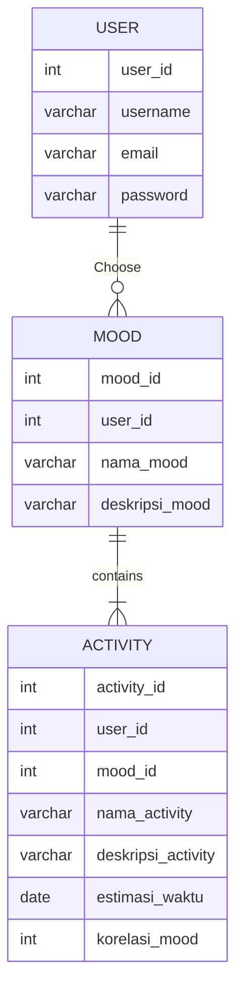

## 1.1 Latar Belakang

Aplikasi "TimeVibe's" adalah solusi inovatif yang lahir dari kesadaran akan pentingnya manajemen waktu yang efektif dan dampak mood atau perasaan individu terhadap produktivitas dan kesejahteraan pribadi. Aplikasi ini bertujuan untuk membantu pengguna mengatur waktu mereka berdasarkan kondisi emosional mereka, sehingga mereka dapat mencapai tujuan mereka dengan lebih baik dan merasa lebih seimbang dalam hidup mereka.

Hubungan antara Mood dan Produktivitas: Penelitian telah menunjukkan bahwa mood atau perasaan seseorang dapat berdampak signifikan pada produktivitas dan kemampuan untuk menyelesaikan tugas. Saat seseorang merasa bahagia, mereka cenderung lebih produktif dan efisien. Sebaliknya, mood negatif seperti stres atau kecemasan dapat menghambat kinerja.

Kebutuhan akan Manajemen Waktu yang Lebih Kontekstual: Banyak aplikasi manajemen waktu yang ada fokus pada aspek-aspek praktis seperti jadwal atau daftar tugas. Namun, sedikit yang mempertimbangkan konteks emosional pengguna saat merencanakan aktivitas.

## 1.2. Deksripsi Teknologi Informasi

"TimeVibe's" adalah sebuah aplikasi manajemen waktu yang unik yang memberikan perasaan dan emosi Anda tempat yang layak dalam perencanaan harian Anda. Aplikasi ini didesain untuk membantu Anda mencapai tujuan Anda dengan lebih baik dengan memperhatikan mood atau perasaan Anda pada saat itu.

Dengan "TimeVibe's," Anda dapat:

1. Masukkan Mood: Ketika Anda membuka aplikasi, Anda dapat dengan mudah memasukkan perasaan atau mood Anda saat ini. Apakah Anda merasa senang, sedih, bahkan bosan, "TimeVibe's" akan memperhitungkan mood Anda.
2. Masukkan tingkat korelasi: Ketika sejauh mana aktivitas tertentu berkaitan dengan atau relevan dengan mood atau perasaan yang dimasukkan oleh anda.
3. Meningkatkan Produktivitas: Dengan memperhatikan mood Anda, Anda dapat merencanakan hari Anda dengan lebih bijak. Ini membantu Anda mengatasi tugas dengan lebih efisien dan merasa lebih seimbang dalam hidup Anda.

## 1.3. Branding

Analysis : Branding

1. Merk : TimeVibe's

2. Tagline : "Mood Your Time: Kelola Waktu Anda Sesuai Suasana Hati."

3. Campaign : Memperkenalkan pengguna ke aplikasi manajemen waktu berdasarkan mood Pengguna dan mendemonstrasikan bagaimana aplikasi dapat membantu
   pengguna mengelola waktu mereka dengan lebih baik dan membantu meningkatkan produktivitas.

4. Target User :
   - Usia 15+
   - seorang profesional yang memiliki jadwal padat dan sering merasa tertekan.
   - Siswa dan mahasiswa sering menghadapi tekanan akademik dan emosional.
   - Orang-orang yang sangat peduli tentang kesejahteraan mental mereka dan ingin mencapai keseimbangan emosional.
   - Orang-orang yang mencari cara untuk meningkatkan produktivitas mereka sambil mengoptimalkan perasaan dan mood mereka .
   - Orang-orang yang mencari keseimbangan hidup yang lebih baik antara pekerjaan, rekreasi, dan kesejahteraan pribadi.

User Experience theme:

- Mudah
- user friendly
- Warna:

  - Happy Mood : Citrus #FAAF08 , Grapefruit #FA812F , Ruby-Red #FA4032 , Off White #FEF3E2

  - Sad Mood : Blue-Green #2C4A52 , Waterway #537072 , Haze #8E9B97 , smog #F4EBDB

  - Bored Mood : Metal #6C5F5B , Kraft-paper #CDAB81 , Newsprint #DAC3B3 , Pewter #4F4A45

  - Chill Mood : Sunrise #FFCCBB , Blue-Topaz #6EB5C0 , Cerulean #006C84 , Icicle #E2E8E4

## 2. User Story

| Sebagai  | Saya ingin bisa                                                  | sehingga                                                         | prioritas  |
| -------- | ---------------------------------------------------------------- | ---------------------------------------------------------------- | ---------- |
| Pengguna | mendaftar ke dalam aplikasi TimeVibe's                           | saya dapat menggunakan semua fitur yang ditawarkan.              | ⭐⭐⭐⭐⭐ |
| pengguna | masuk ke dalam akun saya                                         | saya dapat mengakses aplikasi.                                   | ⭐⭐⭐⭐⭐ |
| pengguna | melihat halaman beranda dengan daftar mood saat ini              | saya dapat memilih mood saya.                                    | ⭐⭐⭐⭐   |
| pengguna | melihat daftar aktivitas yang sudah saya rencanakan              | saya dapat melacak kemajuan saya.                                | ⭐⭐⭐     |
| pengguna | mengedit atau menghapus aktivitas yang sudah saya rencanakan     | saya dapat mengatur kembali aktivitas                            | ⭐⭐⭐⭐   |
| pengguna | memiliki tampilan kalender                                       | saya dapat melihat jadwal dari waktu ke waktu                    | ⭐⭐⭐⭐   |
| pengguna | melihat deskripsi lengkap untuk setiap mood                      | saya dapat memahami dan memilih mood yang sesuai                 | ⭐⭐⭐     |
| pengguna | membuat daftar aktivitas                                         | saya dapat merencanakan aktivitas sesuai mood.                   | ⭐⭐⭐⭐⭐ |
| pengguna | memilih tingkat korelasi antara aktivitas dan mood saya saat ini | saya dapat menyesuaikan aktivitas yang lebih sesuai dengan mood. | ⭐⭐⭐⭐⭐ |
| pengguna | melihat panduan penggunaan aplikasi                              | saya dapat mengerti penggunaan aplikasi.                         | ⭐⭐⭐⭐   |

## 3. Struktur Data

Entity Relationship Diagrams



## 4. Arsitektur Sistem

```mermaid
    flowchart TD
        ubgraph ide1 [Cloud]
        id1[(Database: MySQL)] <--> id2(Aplikasi Web Backend: PHP)
        id2(Aplikasi Web Backend: PHP) <--> id3(Web Server: Apache HTTP Server)
        end
        id3(Web Server: Apache HTTP Server) <--> id4(Aplikasi Web: HTML, CSS-Bootstrap, JavaScript)
```

## 5. Teknologi, Library, dan Framework

bla bla bla

## 6. Desain User Experience dan User Interface

Bisa load image


## 7. Demonstrasi Video

Link youtube nya

## 8. Bagaimana mesin komputasi dan sistem operasi berperan dalam produk teknologi informasimu ?

Link youtube nya di detik jawaban ini

## 9. Bagaimana algoritma, struktur data, dan bahasa pemrograman berperan dalam produk teknologi informasimu ?

Link youtube nya di detik jawaban ini

## 10. Bagaimana metode pengembangan perangkat lunak / Software Development Life Cycle berperan dalam produk teknologi informasimu ?

Link youtube nya di detik jawaban ini

## 11. Bagaimana database / sistem basis data berperan dalam produk teknologi informasimu ?

Link youtube nya di detik jawaban ini

```

```
