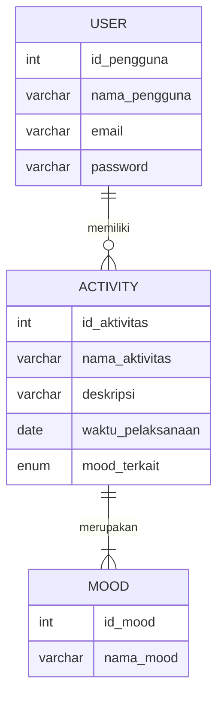
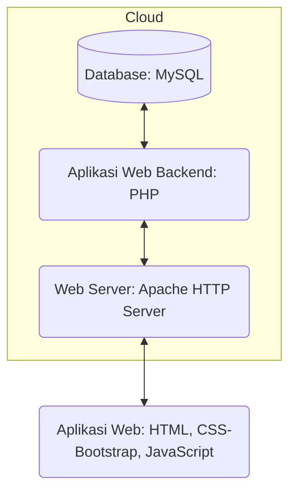

## 1.1 Latar Belakang

Aplikasi "TimeVibe's" adalah sebuah solusi inovatif untuk manajemen waktu berdasarkan mood. Tujuannya adalah membantu pengguna mengelola waktu mereka dengan lebih baik dengan mempertimbangkan perasaan dan mood yang mereka alami saat melakukan aktivitas. Aplikasi ini memungkinkan pengguna untuk mencatat aktivitas mereka, mengaitkannya dengan mood yang dirasakan, dan dengan demikian membantu dalam mengidentifikasi pola produktivitas pribadi.

**Penelitian tentang Mood dan Produktivitas:**

Riset yang telah dilakukan di seluruh dunia menunjukkan bahwa mood dan suasana hati dapat memiliki dampak yang signifikan pada produktivitas seseorang. Beberapa temuan penelitian yang relevan mencakup:

1. **Pengaruh Mood Positif pada Kinerja:**

   - Penelitian telah menunjukkan bahwa suasana hati positif, seperti perasaan bahagia dan puas, dapat meningkatkan produktivitas. Individu yang merasa bahagia lebih cenderung fokus dan kreatif dalam pekerjaan mereka.

2. **Stres dan Mood Negatif Menghambat Produktivitas:**

   - Mood negatif, seperti stres dan kecemasan, cenderung mengurangi produktivitas. Individu yang merasa tertekan mungkin kesulitan berkonsentrasi dan menyelesaikan tugas dengan efektif.

3. **Korelasi antara Mood dan Kinerja:**

   - Beberapa penelitian menunjukkan bahwa ada korelasi positif antara mood dan kinerja kerja. Individu yang memiliki mood yang baik dan stabil cenderung lebih produktif.

4. **Mood dan Kreativitas:**

   - Mood juga berpengaruh pada kreativitas. Mood yang positif dapat meningkatkan kemampuan untuk berpikir kreatif, menghasilkan ide-ide baru, dan menyelesaikan masalah dengan cara yang inovatif.

5. **Peran Manajemen Waktu:**
   - Mood dapat memengaruhi cara individu mengelola waktu mereka. Seseorang yang merasa bahagia mungkin lebih cenderung mengatur waktu dengan baik dan mengoptimalkan produktivitas mereka.

**Kesimpulan:**

Aplikasi "TimeVibe's" didasarkan pada pemahaman bahwa mood memainkan peran penting dalam produktivitas seseorang. Dengan mengintegrasikan pengelolaan waktu berdasarkan mood, aplikasi ini membantu individu dalam memahami lebih baik pola produktivitas pribadi mereka dan membuat keputusan yang lebih baik dalam pengelolaan waktu. Ini bertujuan untuk membantu pengguna meraih produktivitas yang lebih baik dan perasaan kesejahteraan secara keseluruhan.

## 1.2. Deksripsi Teknologi Informasi

"TimeVibe's" adalah solusi pintar untuk membantu pengguna meraih produktivitas dan kesejahteraan pribadi dengan memanfaatkan emosi dan mood pengguna . Aplikasi ini memungkinkan pengguna untuk mencatat aktivitas, menghubungkannya dengan perasaan yang pengguna alami, dan menciptakan pola unik dalam pengelolaan waktu pengguna. Beberapa fitur utama termasuk:

- Manajemen Aktivitas Berbasis Mood: pengguna dapat dengan mudah mencatat aktivitas pengguna dan menandai mood yang pengguna alami saat melakukan aktivitas tersebut. Aplikasi ini akan membantu pengguna memahami bagaimana mood pengguna memengaruhi produktivitas.

- Analisis Pola Waktu: "TimeVibe's" akan menyajikan analisis data yang membantu pengguna melihat pola waktu pengguna berdasarkan mood. pengguna dapat menemukan saat-saat yang paling produktif dan merencanakan aktivitas sesuai dengan mood Anda.

- Perencanaan Harian yang Cerdas: Aplikasi ini memberikan rekomendasi perencanaan harian berdasarkan mood dan tujuan pengguna. Ini membantu pengguna merencanakan waktu yang optimal untuk tugas-tugas penting.

- Notifikasi yang Dipersonalisasi: Aplikasi ini akan memberikan notifikasi yang dipersonalisasi untuk mengingatkan pengguna tentang aktivitas dan perubahan mood yang dapat memengaruhi kinerja pengguna.

- Keamanan dan Privasi: Kami memprioritaskan keamanan dan privasi data pengguna. Data mood dan aktivitas pengguna akan tetap aman dan hanya dapat diakses oleh pengguna.

Berikut algoritma lengkap yang menggambarkan fitur-fitur utama dalam aplikasi "TimeVibe's," termasuk manajemen aktivitas berbasis mood, analisis pola waktu, perencanaan harian, notifikasi, serta keamanan dan privasi data. Algoritma ini memberikan gambaran umum tentang bagaimana aplikasi ini berfungsi:

**Algoritma Aplikasi "TimeVibe's"**

1. **Registrasi dan Masuk Aplikasi:**

   - Pengguna mendaftar dengan mengisi informasi dasar seperti nama, alamat email, dan kata sandi yang aman.
   - Pengguna masuk ke aplikasi dengan account yang telah dibuat.

2. **Manajemen Aktivitas:**

   - Pengguna dapat menambahkan aktivitas baru ke dalam aplikasi.
   - Setiap aktivitas mencakup detail seperti nama aktivitas, deskripsi, waktu pelaksanaan, dan mood yang mereka rasakan saat melakukan aktivitas tersebut.

3. **Perekaman Mood:**

   - Pengguna memilih mood atau perasaan yang mereka alami saat menambahkan aktivitas.
   - Mood diidentifikasi dalam berbagai kategori, seperti bahagia, sedih, stres, santai, dsb.

4. **Analisis Pola Waktu:**

   - Aplikasi mengumpulkan data aktivitas dan mood yang telah dimasukkan oleh pengguna.
   - Data ini digunakan untuk menganalisis pola waktu pengguna, seperti kapan mereka cenderung lebih produktif, kreatif, atau santai.

5. **Rekomendasi Perencanaan Harian:**

   - Berdasarkan analisis pola waktu dan mood, aplikasi memberikan rekomendasi perencanaan harian kepada pengguna.
   - Rekomendasi ini mencakup aktivitas yang dapat dijadwalkan berdasarkan mood yang paling sesuai untuk waktu tertentu.

6. **Notifikasi Personalisasi:**

   - Aplikasi mengirimkan notifikasi kepada pengguna untuk mengingatkan mereka tentang aktivitas yang telah direncanakan dan mengingatkan perubahan mood yang dapat memengaruhi produktivitas.
   - Notifikasi dipersonalisasi berdasarkan preferensi pengguna.

7. **Keamanan dan Privasi:**

   - Data mood, aktivitas, dan informasi pengguna disimpan dengan aman dalam basis data yang dienkripsi.
   - Hanya pengguna yang memiliki akses ke data pribadi mereka.

8. **Penyempurnaan dan Pemeliharaan:**

   - Aplikasi terus dikembangkan dengan perbaikan dan pembaruan fitur sesuai dengan umpan balik pengguna dan perkembangan teknologi.

9. **Keluar Aplikasi:**
   - Pengguna dapat keluar dari aplikasi dengan aman dan data mereka akan tetap tersimpan.

**Skenario Notifikasi Perubahan Mood:**

1. **Pengguna Masuk ke Aplikasi:**

   - Pengguna telah mendaftar dan masuk ke aplikasi "TimeVibe's."

2. **Tambahkan Aktivitas dan Mood:**

   - Pengguna mulai menambahkan aktivitas mereka ke aplikasi sepanjang hari.
   - Setiap kali mereka menambahkan aktivitas, mereka juga memilih mood yang mereka rasakan saat melakukan aktivitas tersebut.

3. **Perubahan Mood yang Signifikan:**

   - Selama beberapa hari, aplikasi "TimeVibe's" mencatat mood pengguna seiring waktu.
   - Algoritma analisis mood mendeteksi perubahan mood yang signifikan. Misalnya, pengguna biasanya merasa bahagia saat bekerja, tetapi dalam beberapa hari terakhir mereka mulai merasa sedih atau stres saat bekerja.

4. **Notifikasi Personalisasi:**

   - Aplikasi "TimeVibe's" mengirimkan notifikasi kepada pengguna ketika mendeteksi perubahan mood yang signifikan.
   - Notifikasi tersebut dapat berbunyi seperti, "Kami melihat perubahan mood Anda saat bekerja. Apakah ada sesuatu yang sedang mengganggu? Kami dapat membantu Anda mengelola waktu dengan lebih baik."

5. **Tawaran Dukungan:**
   - Notifikasi juga dapat menawarkan dukungan, seperti mengarahkan pengguna ke artikel atau alat bantu untuk mengatasi stres atau merasa lebih baik.
   - Pengguna dapat memilih untuk menerima saran atau hanya mengonfirmasi bahwa mereka menyadari perubahan mood mereka.

## 1.3. Branding

Analysis : Branding

1. Merk : TimeVibe's

2. Tagline : "Mood Your Time: Kelola Waktu Anda Sesuai Suasana Hati."

3. Campaign : Memperkenalkan pengguna ke aplikasi manajemen waktu berdasarkan mood Pengguna dan mendemonstrasikan bagaimana aplikasi dapat membantu pengguna mengelola waktu mereka dengan lebih baik dan membantu meningkatkan produktivitas.

4. Target User :
   - seorang profesional yang memiliki jadwal padat dan sering merasa tertekan.
   - Siswa dan mahasiswa sering menghadapi tekanan akademik dan emosional.
   - Orang-orang yang sangat peduli tentang kesejahteraan mental mereka dan ingin mencapai keseimbangan emosional.
   - Orang-orang yang mencari cara untuk meningkatkan produktivitas mereka sambil mengoptimalkan perasaan dan mood mereka .
   - Orang-orang yang mencari keseimbangan hidup yang lebih baik antara pekerjaan, rekreasi, dan kesejahteraan pribadi.

User Experience theme:

- Mudah
- user friendly
- Warna:

  - Happy Mood : Citrus #FAAF08 , Grapefruit #FA812F , Ruby-Red #FA4032 , Off White #FEF3E2

  - Sad Mood : Blue-Green #2C4A52 , Waterway #537072 , Haze #8E9B97 , smog #F4EBDB

  - Bored Mood : Metal #6C5F5B , Kraft-paper #CDAB81 , Newsprint #DAC3B3 , Pewter #4F4A45

  - Chill Mood : Sunrise #FFCCBB , Blue-Topaz #6EB5C0 , Cerulean #006C84 , Icicle #E2E8E4

## 2. User Story

| Sebagai  | Saya Ingin bisa                                                   | Sehingga saya dapat                      | prioritas  |
| -------- | ----------------------------------------------------------------- | ---------------------------------------- | ---------- |
| Pengguna | Mendaftar akun dengan cepat dan mudah                             | Mulai menggunakan aplikasi               | ⭐⭐⭐⭐⭐ |
| Pengguna | Masuk ke akun saya dengan mudah dan aman                          | Mengakses fitur-fitur aplikasi           | ⭐⭐⭐⭐⭐ |
| Pengguna | Menambahkan aktivitas yang saya rencanakan berdasarkan mood saya  | Melacak aktivitas dan mood saya          | ⭐⭐⭐⭐   |
| Pengguna | Melihat grafik atau analisis pola waktu saya berdasarkan mood     | Memahami kapan saya paling produktif     | ⭐⭐⭐⭐   |
| Pengguna | Menerima rekomendasi perencanaan harian                           | Mengelola waktu saya dengan lebih baik   | ⭐⭐⭐⭐⭐ |
| Pengguna | Menerima notifikasi yang dipersonalisas                           | Menjaga produktivitas saya               | ⭐⭐⭐⭐⭐ |
| Pengguna | Yakin bahwa data mood, aktivitas, dan informasi pribadi saya aman | Menggunakan aplikasi dengan percaya diri | ⭐⭐⭐⭐⭐ |
| Pengguna | Aplikasi terus diperbaiki dan diperbarui                          | Memiliki pengalaman yang lebih baik      | ⭐⭐⭐⭐   |

## 3. Struktur Data

Entity Relationship Diagrams



## 4. Arsitektur Sistem



## 5. Teknologi, Library, dan Framework

1. **Bahasa Pemrograman**:

   - **HTML (Hypertext Markup Language)**: HTML adalah bahasa pemrograman yang digunakan untuk membuat struktur halaman web. Ini adalah dasar dari semua halaman web dan digunakan untuk menentukan elemen-elemen seperti teks, gambar, tautan, dan formulir.

   - **CSS (Cascading Style Sheets)**: CSS digunakan untuk mengatur tampilan dan gaya halaman web. Ini memungkinkan Anda untuk mengendalikan warna, ukuran teks, layout, dan tata letak halaman.

   - **JavaScript**: JavaScript adalah bahasa pemrograman yang digunakan untuk menambahkan interaktivitas ke halaman web. Anda dapat menggunakannya untuk membuat efek animasi, validasi formulir, dan berbagai fitur interaktif.

   - **PHP (Hypertext Preprocessor)**: PHP adalah bahasa pemrograman server-side yang digunakan untuk mengembangkan logika backend aplikasi. Ini memungkinkan Anda untuk mengolah data, mengelola basis data, dan menghasilkan konten dinamis untuk pengguna.

   **Alasan**: Menggabungkan HTML, CSS, JavaScript, dan PHP memungkinkan Anda untuk membangun aplikasi web dengan tampilan menarik, interaktivitas, dan kemampuan pemrosesan data di sisi server.

2. **Framework (Frontend)**:

   - **Bootstrap 5**: Bootstrap adalah kerangka kerja frontend yang memudahkan desain dan pengembangan tampilan antarmuka pengguna (UI). Ini menyediakan komponen dan gaya yang sudah jadi sehingga Anda dapat merancang halaman web dengan cepat dan responsif.

   **Alasan**: Bootstrap membantu mempercepat pengembangan frontend dengan memberikan komponen UI yang siap digunakan dan memastikan tampilan aplikasi terlihat baik di berbagai perangkat.

3. **Basis Data**:

   - **MySQL**: MySQL adalah sistem manajemen basis data (DBMS) yang populer dan open source. Ini digunakan untuk menyimpan dan mengelola data aplikasi, seperti aktivitas yang dijadwalkan dan mood pengguna.

   **Alasan**: MySQL adalah pilihan yang solid untuk penyimpanan data dalam aplikasi web karena kinerjanya yang baik, keandalan, dan komunitas pengguna yang besar.

4. **Server Web**:

   - **Apache**: Apache adalah server web yang umum digunakan untuk meng-host aplikasi web. Ini melayani halaman web kepada pengguna dan mengelola permintaan HTTP.

   **Alasan**: Apache adalah server web yang mapan dan stabil, serta mudah dikonfigurasi. Ini memungkinkan aplikasi Anda untuk diakses melalui internet dengan andal.

## 6. Desain User Experience dan User Interface

https://www.figma.com/file/0u8Ft1HOMaJ8rXrq408M9J/TimeVibe's?type=design&node-id=0%3A1&mode=design&t=BpLF4HMLO905JQOv-1

      

## 7. Demonstrasi Video

Link youtube nya

## 8. Bagaimana mesin komputasi dan sistem operasi berperan dalam produk teknologi informasimu ?

Link youtube nya di detik jawaban ini

## 9. Bagaimana algoritma, struktur data, dan bahasa pemrograman berperan dalam produk teknologi informasimu ?

Link youtube nya di detik jawaban ini

## 10. Bagaimana metode pengembangan perangkat lunak / Software Development Life Cycle berperan dalam produk teknologi informasimu ?

Link youtube nya di detik jawaban ini

## 11. Bagaimana database / sistem basis data berperan dalam produk teknologi informasimu ?

Link youtube nya di detik jawaban ini

```

```
